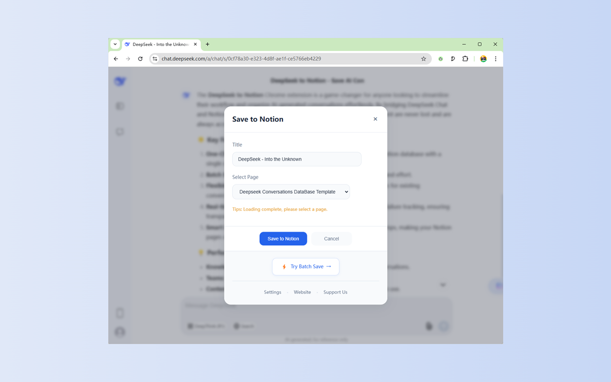

# DeepSeek to Notion - Save DeepSeek Conversations to Notion with One Click

  

  
  
  

  <a href="README.md">English</a> | <a href="README_zh.md">中文</a>

<h2 id="english">English</h2>

## ✨ Features

### 🚀 One-Click Save
- Floating "Save to Notion" button on DeepSeek chat interface
- Instantly save current conversation to your Notion database
- Smart extraction of chat title, content, and timestamp

### 📚 Batch Synchronization
- Bulk sync historical conversations to Notion
- Customizable page range selection
- Real-time progress tracking
- Cancellable sync operations

### 🔄 Flexible Sync Strategies
- Skip existing conversations
- Overwrite existing pages
- Create new pages (Duplicate mode)

### 🔌 Notion Integration
- Seamless connection to Notion workspace
- Multiple database selection
- Database list refresh support

## 🎯 Use Cases

1. **Knowledge Management**
   - Preserve valuable DeepSeek conversations
   - Build your personal knowledge base in Notion

2. **Team Collaboration**
   - Share important AI conversations
   - Centralize team's AI interaction records

3. **Content Archiving**
   - Batch backup historical chats
   - Prevent loss of important conversations

## ⚙️ Setup Guide

1. **Notion Authorization**
   - Click "Connect to Notion" to authorize
   - Select target database

2. **Sync Configuration**
   - Choose page range for sync
   - Set sync strategy (Skip/Overwrite/Duplicate)

3. **Subscription Verification**
   - Verify subscription status with email
   - Batch sync requires subscription

## 💫 Key Advantages

- Clean and modern user interface
- Real-time sync progress
- Detailed success/failure logs
- Pause and resume capability
- Comprehensive error handling

## 🔗 Quick Links

- Website: https://deepseek2notion.aluo.app
- Documentation: https://obtainable-cinnamon-d87.notion.site/DeepSeek-to-Notion-Home-19119e4fc636804b887ad74f7c6cb596
- Support: aluoapps@gmail.com

## 🛠️ Technical Support

- Compatible with latest DeepSeek Chat
- Supports major browsers
- Regular updates and maintenance
- Professional technical support

## 🚀 Roadmap

- Enhanced sync customization options
- Performance optimization
- Advanced analytics features
- Additional Notion templates

## 📝 License

This project is licensed under the MIT License - see the [LICENSE](LICENSE) file for details.

---

Make DeepSeek to Notion your AI conversation management assistant for effortless knowledge accumulation and team collaboration!

  

  

  

