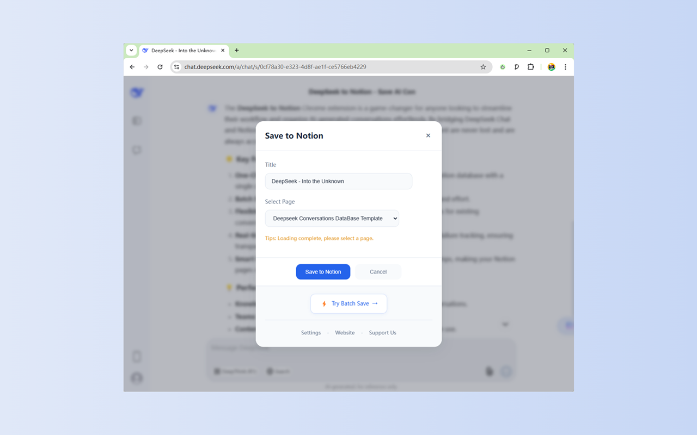
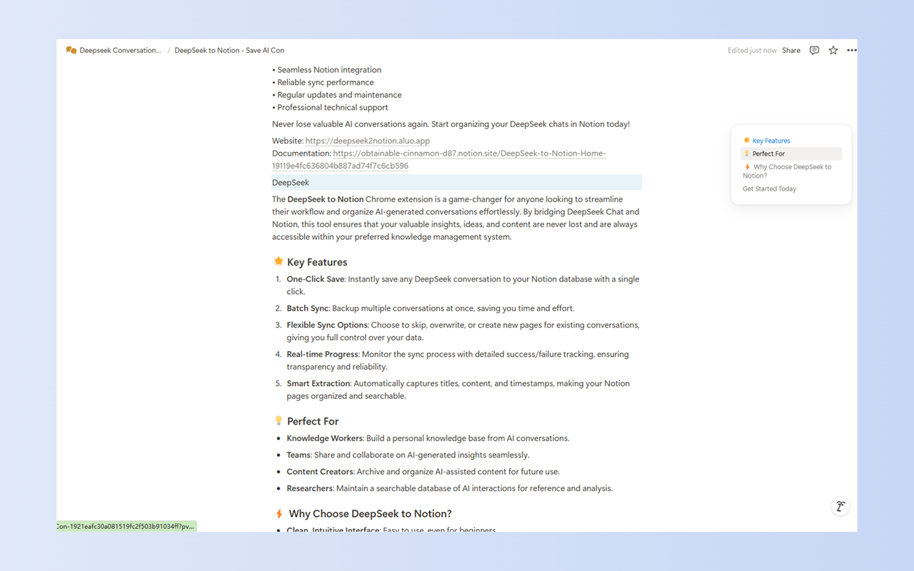
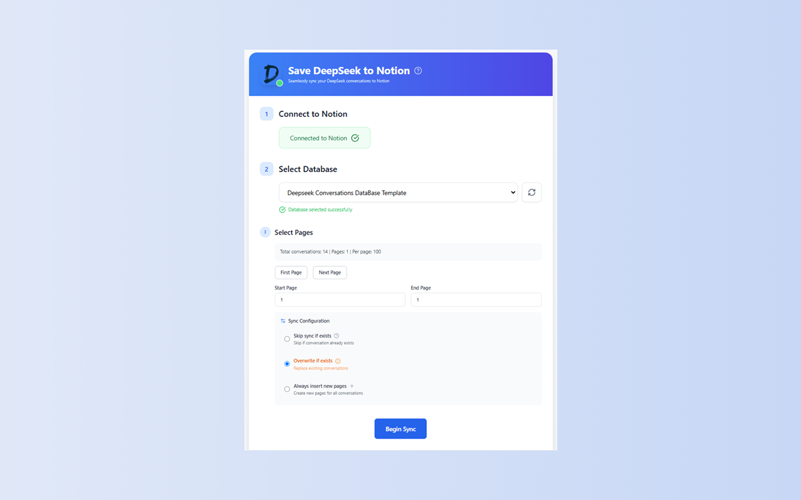

# DeepSeek to Notion - 一键保存 DeepSeek 对话到 Notion

## ✨ 功能特点

### 🚀 一键保存
- DeepSeek 聊天界面的悬浮"保存到 Notion"按钮
- 即时保存当前对话到你的 Notion 数据库
- 智能提取聊天标题、内容和时间戳

### 📚 批量同步
- 批量同步历史对话到 Notion
- 可自定义页面范围选择
- 实时进度跟踪
- 可取消的同步操作

### 🔄 灵活的同步策略
- 跳过已存在的对话
- 覆盖现有页面
- 创建新页面（复制模式）

### 🔌 Notion 集成
- 无缝连接到 Notion 工作区
- 多数据库选择
- 支持数据库列表刷新

## 🎯 使用场景

1. **知识管理**
   - 保存有价值的 DeepSeek 对话
   - 在 Notion 中建立个人知识库

2. **团队协作**
   - 分享重要的 AI 对话
   - 集中管理团队的 AI 互动记录

3. **内容归档**
   - 批量备份历史聊天记录
   - 防止重要对话丢失

## ⚙️ 设置指南

1. **Notion 授权**
   - 点击"连接到 Notion"进行授权
   - 选择目标数据库

2. **同步配置**
   - 选择同步的页面范围
   - 设置同步策略（跳过/覆盖/复制）

## 💫 核心优势

- 清新现代的用户界面
- 实时同步进度
- 详细的成功/失败日志
- 暂停和恢复功能
- 全面的错误处理

## 🔗 快速链接

- 网站：https://deepseek2notion.aluo.app
- 文档：https://obtainable-cinnamon-d87.notion.site/DeepSeek-to-Notion-Home-19119e4fc636804b887ad74f7c6cb596
- 支持：aluoapps@gmail.com

## 🛠️ 技术支持

- 兼容最新版 DeepSeek Chat
- 支持主流浏览器
- 定期更新和维护
- 专业技术支持

## 🚀 未来规划

- 增强同步自定义选项
- 性能优化
- 高级分析功能
- 更多 Notion 模板

## 📝 许可证

本项目采用 MIT 许可证 - 详见 [LICENSE](LICENSE) 文件。

---

让 DeepSeek to Notion 成为你的 AI 对话管理助手，轻松实现知识积累和团队协作！

  

  

  

